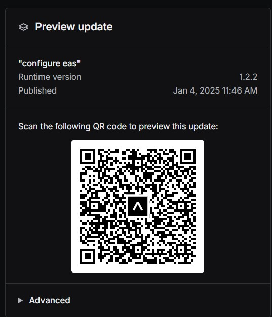
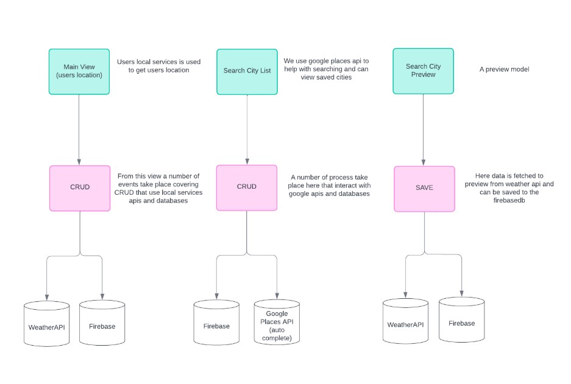
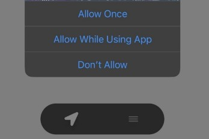
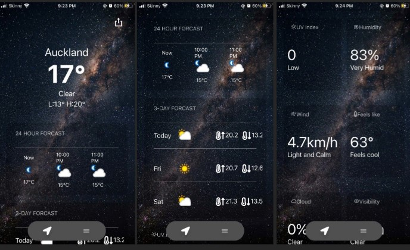
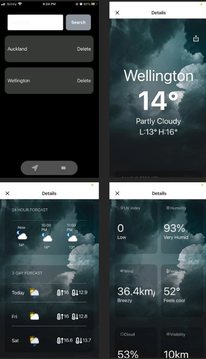
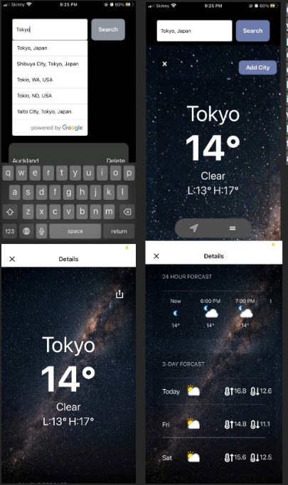
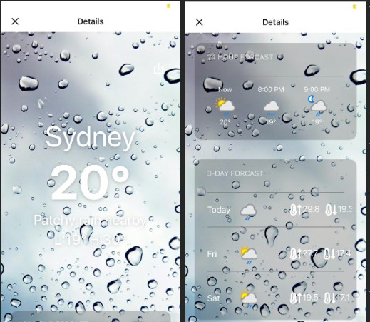
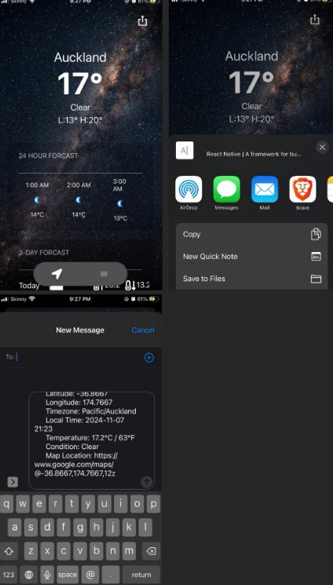

# weather-updated

## About

Our application is an IOS and Android mobile weather app, that uses several services such as Location services, Firebase cloud database, Weather API and Google Places.  

## Prerequisites

1. **Install Expo Go (you do no need to register to use the app)**:
   - **iOS**: [Download Expo Go from the App Store](https://apps.apple.com/us/app/expo-go/id982107779).
   - **Android**: [Download Expo Go from Google Play](https://play.google.com/store/apps/details?id=host.exp.exponent). 

## Running the App

1. **How to view the app**:
   - Scan the QR code displayed below using the **Expo Go** app on your phone or by scanning it with your camera.
     The app hosted live and can be viewed by downloading the **Expo Go** app from your app store and scanning the following QR code below:

[Scan this QR code to view the app](https://expo.dev/preview/update?message=configure%20eas&updateRuntimeVersion=1.2.2&createdAt=2025-01-03T22%3A46%3A43.758Z&slug=exp&projectId=66cbf7f4-3f1d-4cb7-b21a-738c6f2c41a8&group=9e8508fb-815b-440a-9757-6fa36dbfe40c).

### If link is not working can scan here

 

## Archtecture Diagram

The following is a simplified overview of how our code is designed and laid out in its structure and behaviour in terms of the relationship between components.

 

## API and services

As seen in the diagram and mentioned in the About section of the document the weather application uses a number of APIs and services and are as follows:

- Location services

- Shared content servicers

- Firebase Cloud database

- Weather API

- Google places (currently inactivated)

## Demo screen shots

1. **Location services**:As soon as the application is open a prompt is shown requesting access to the user's device location.

2. **Weather API**:Once the user gives permission, the application will then use the user's location to fetch data from [weatherapi.com](https://www.weatherapi.com/) related to their current location.

3. **Data management**:There is a large amount of data being fetched sorted and managed, for creating a 24hour forecast list that is arranged by the hour and location, the 3 day forecast and the grouping of extra data at the bottom.

4. **Firebase database**:On the bottom of the screen, a nav bar can be seen with an arrow and a hamburger icon. If you click the hamburger icon at the bottom of the screen you will be taken to the user's stored locations. These stored cities are saved on a database. As you can see, we already have Auckland and Wellington saved, your location is also saved as a default in the list. From the list you can select your saved cities to see the current temperature and so on for that city

5. **Google places services API**:You can also use the search tab to look up a city. As you can see below, we are using Google Places API to display auto complete suggestions as you type. You can find more information about it here: [google places api](https://developers.google.com/maps/documentation/places/web-service/overview). Once you click search you will be displayed a preview where you can choose to save the city or click the “x” on the top left to close and go back, in this case, we will save which will also save in the Firebase database using their API and is disabled it already saved.

6. **Dynamic UI**:You may have also noticed that the background image will change depending on if it is day or late in the day and depending on the weather of the current city being viewed.

7. **Content sharing**:You can also use the shared feature to share information from the weather app to other applications on the user’s device as seen below where we share some basic information about Auckland weather through the messaging app.

8. **Unit test**:
   our utility functions were tested to make sure converting weather data was correct.

