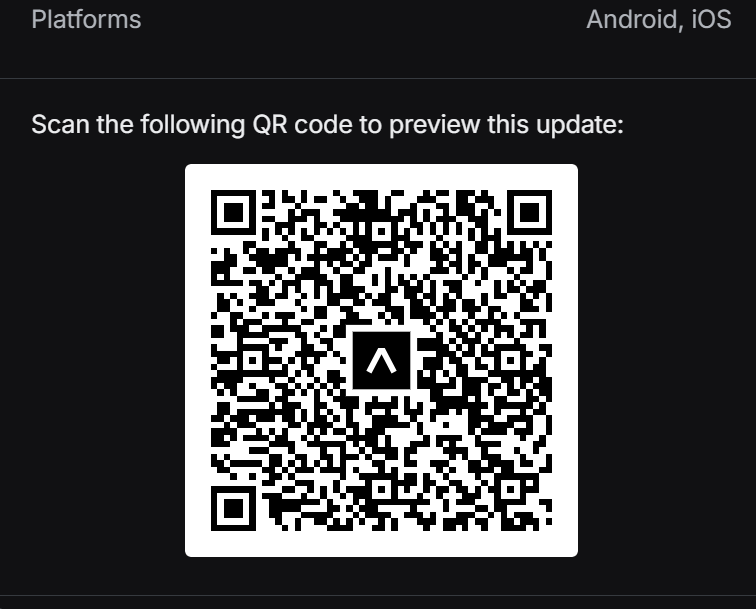
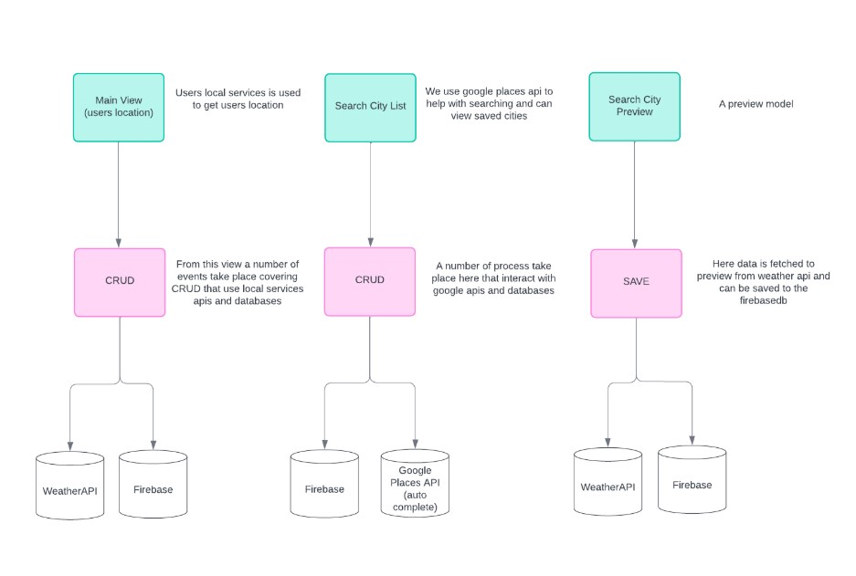
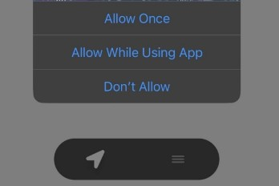
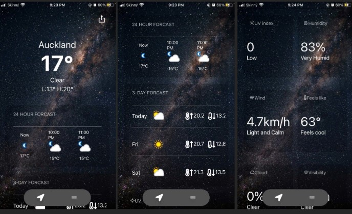
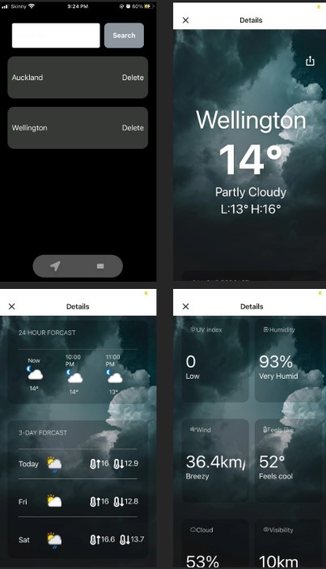
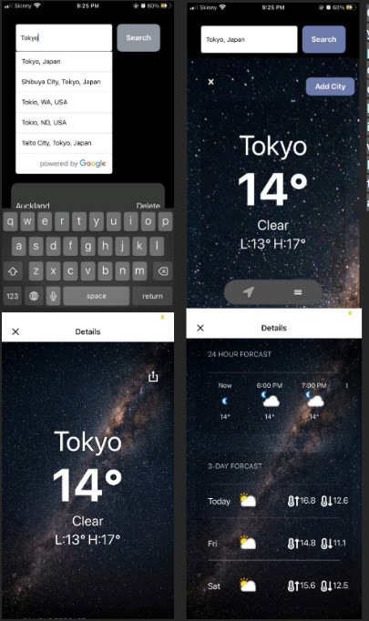
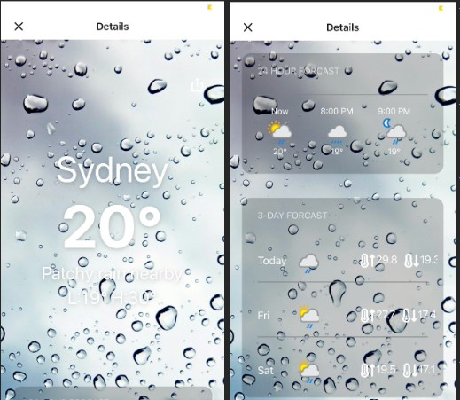
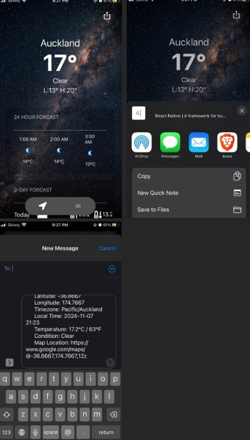
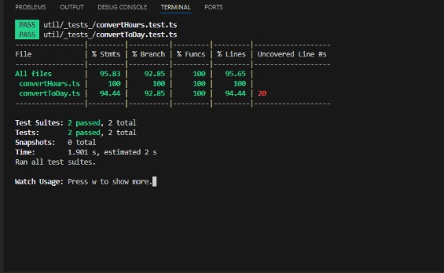

# 🌦️ Weather Updated

A modern **iOS and Android mobile weather application** built with **Expo (React Native)** and **TypeScript**.
The app integrates **multiple cloud services and APIs** including Location Services, Firebase, WeatherAPI, and Google Places to deliver a personalized and dynamic weather experience.

---

## 📱 Prerequisites

1. **Install Expo Go** (no registration required):
   - **iOS:** [Download from the App Store](https://apps.apple.com/us/app/expo-go/id982107779)
   - **Android:** [Download from Google Play](https://play.google.com/store/apps/details?id=host.exp.exponent)

---

## 🚀 Running the App

1. **To view the app:**
   - Open the **Expo Go** app on your phone.
   - Scan the QR code below using your camera or the Expo Go scanner.
   - The latest version of the app will open automatically.

👉 [Click here to open the Expo preview](https://expo.dev/preview/update?message=Updated+Expo+config+and+fixed+root-level+warning&updateRuntimeVersion=1.0.0&createdAt=2025-10-21T23%3A15%3A25.450Z&slug=exp&projectId=66cbf7f4-3f1d-4cb7-b21a-738c6f2c41a8&group=41cd6940-4b23-4ddd-83fa-704952b6beae)

### If the link does not work, scan this QR code:

---

## 🧩 Architecture Overview

The following diagram provides a simplified overview of how the codebase is structured and how components interact:

The app follows a **modular architecture**, separating logic into layers for clarity and scalability:

- **Presentation Layer:** Handles UI rendering, animations, and dynamic styling.
- **Business Logic Layer:** Coordinates data retrieval, weather conversions, and API interactions.
- **Data Layer:** Manages persistence via Firebase Cloud Database and local device storage.

---

## 🌐 APIs and Services

The **Weather Updated** app integrates several APIs and services to deliver a responsive and data-driven experience:

- 📍 **Location Services** – Detects the user’s location on app launch.
- 🌤️ **WeatherAPI.com** – Provides real-time weather and 24-hour forecasts.
- 🔥 **Firebase Cloud Database** – Stores user-saved cities and related data.
- 🗺️ **Google Places API** – Offers city search and autocomplete suggestions.
- 📤 **Content Sharing Service** – Enables sharing weather details across apps.

> _Note: Google Places integration is currently inactive but prepared for future expansion._

---

## 📸 App Demo Screenshots

### 🔹 1. Location Services

When the app launches, it immediately requests access to the user’s device location.

---

### 🔹 2. Weather API Integration

After location permission is granted, the app fetches weather data for the current city using
[**WeatherAPI.com**](https://www.weatherapi.com/).

---

### 🔹 3. Data Management

The app fetches, sorts, and displays:

- A **24-hour hourly forecast**
- A **3-day extended forecast**
- Additional contextual weather data grouped by location

---

### 🔹 4. Firebase Cloud Database

Tap the **hamburger icon** at the bottom of the screen to view your saved cities.
Each saved city is stored in **Firebase**, including the current location as default.
Users can easily switch between saved cities to view their current weather.

---

### 🔹 5. Google Places API

The **search tab** allows users to look up any city.
The **Google Places API** provides instant autocomplete suggestions as you type.
You can preview the city and choose to save it — duplicates are disabled automatically.

Learn more about the API here: [Google Places API Overview](https://developers.google.com/maps/documentation/places/web-service/overview)

---

### 🔹 6. Dynamic UI

The background image changes dynamically based on:

- Time of day (day / evening)
- Current weather conditions (e.g., sunny, cloudy, rainy)

---

### 🔹 7. Content Sharing

Users can share current weather details directly to other apps (e.g., messaging apps).
Below is an example of sharing Auckland’s weather update.

---

### 🔹 8. Unit Testing

Utility functions were tested to ensure accurate weather data conversions and reliability of business logic.

---

## 🧠 Key Features

- 🌍 Automatic location detection
- 🌦️ Real-time weather updates with 24-hour and 3-day forecasts
- 🔥 Firebase integration for persistent storage
- 🗺️ Google Places search and autocomplete
- 🎨 Dynamic backgrounds based on weather conditions
- 📤 Cross-app content sharing
- 🧪 Unit testing for key utility functions

---

## 👩‍💻 Tech Stack

- **Framework:** React Native (Expo)
- **Language:** TypeScript
- **Backend / Storage:** Firebase Cloud Database
- **APIs:** WeatherAPI.com, Google Places API
- **Utilities:** Location Services, Content Sharing API
- **Tools:** Visual Studio Code, Android Studio

---
